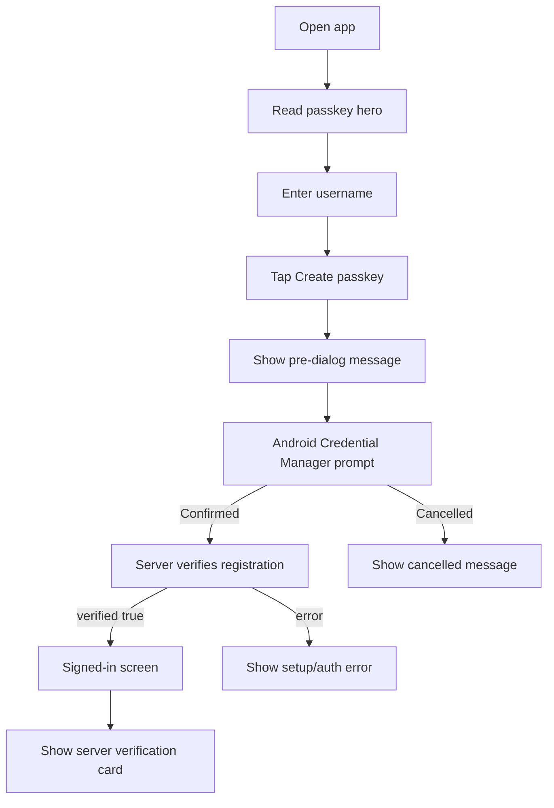
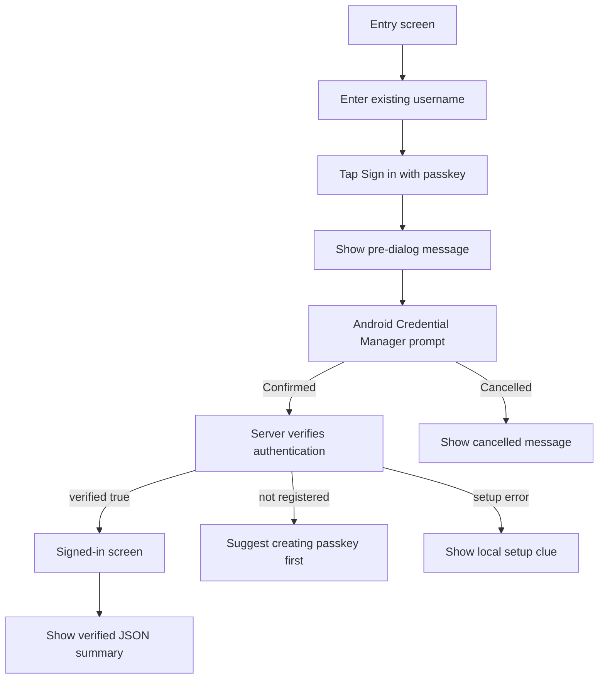
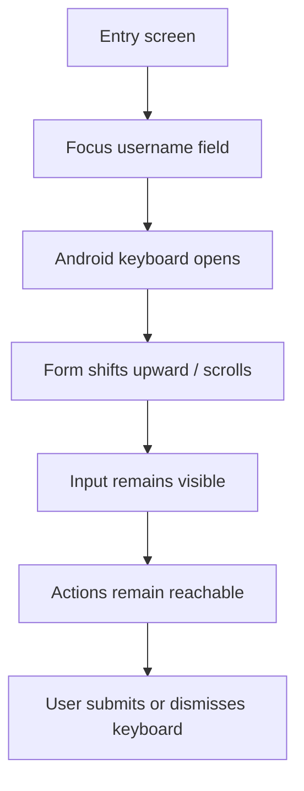

# UX Design Specification passkeys-solution

**Author:** Renato
**Date:** 2026-04-25

---

<!-- UX design content will be appended sequentially through collaborative workflow steps -->

## Executive Summary

### Project Vision

Create a small, credible Android POC that proves passkey registration and login can work end-to-end against a local HTTPS Fastify server. The experience should make a technically complex trust chain feel simple: enter username, register passkey, authenticate, land in a signed-in state.

### Target Users

Primary users are technical evaluators: developers, architects, or stakeholders validating whether passkeys can replace password-based login in a future product. The POC is not for broad consumer rollout yet; it is for proving feasibility, reliability, and developer confidence.

### Key Design Challenges

- Passkeys are invisible until they work, so the UI must explain what is happening without over-teaching WebAuthn.
- Local setup has fragile dependencies: HTTPS, mkcert CA, `adb reverse`, Android Credential Manager, and Digital Asset Links.
- The POC must distinguish user error, setup error, and authentication failure clearly enough for debugging.

### Design Opportunities

- Make the core flow feel calm and trustworthy: "Register", biometric prompt, success, home.
- Add clear system-state feedback so the POC is useful during demos and debugging.
- Design the app as a proof artifact: simple enough to inspect, polished enough to convince.

## Core User Experience

### Defining Experience

The defining experience is a short passkey proof loop: enter a username, register a passkey, land on a signed-in home screen, log out, and sign back in with the same passkey. The POC succeeds when this loop feels understandable, repeatable, and demo-safe.

### Platform Strategy

The experience is Android-first, touch-first, and emulator-focused. It should lean on native Android Credential Manager behavior rather than recreating security UI inside the app. The app should assume online/local server connectivity and make setup-dependent failures visible enough for a technical evaluator to diagnose.

### Effortless Interactions

- Username entry should be the only explicit identity input.
- The distinction between "register" and "enter" should be clear without requiring WebAuthn knowledge.
- The native biometric/passkey prompt should feel like the trusted center of the flow.
- Success should automatically move the user to a home state; no extra confirmation step.
- Logout should reset the demo cleanly without destroying the registered passkey.

### Critical Success Moments

- First passkey creation: the evaluator sees Android request biometric/passkey confirmation and returns to the app successfully.
- First authenticated return: after logout, the same username signs in without a password.
- Failure recovery: if local HTTPS, `adb reverse`, CA trust, or server setup is wrong, the app gives a useful clue rather than a generic crash-like error.

### Experience Principles

- Make the invisible trust chain legible through simple state and feedback.
- Let Android own the sensitive security moment.
- Optimize for a clean technical demo, not production onboarding.
- Every screen should answer: "what just happened, and what can I do next?"

## Desired Emotional Response

### Primary Emotional Goals

The primary emotional goal is confidence. Technical evaluators should feel that the passkey flow is understandable, repeatable, and trustworthy. The experience should reduce skepticism around passkeys by showing a clean proof: no password, native biometric confirmation, successful signed-in state.

### Emotional Journey Mapping

- First view: curious and oriented. The user understands this is a passkeys demo and knows what to try first.
- Registration: slightly cautious but guided. The app sets expectation before Android takes over the sensitive security prompt.
- Success: reassured. The user lands somewhere concrete and can see that registration worked.
- Logout and return: convinced. Signing in again with the same username should feel like the proof moment.
- Failure: informed, not stranded. Errors should feel diagnosable, especially for local setup issues.

### Micro-Emotions

- Trust over skepticism: use native Android passkey UI for the sensitive moment.
- Clarity over confusion: label actions plainly and show short status messages.
- Control over anxiety: never leave the user wondering whether the app is loading, waiting for biometrics, or failed.
- Accomplishment over ambiguity: successful registration/login should land on a clear home state.
- Curiosity over frustration: setup failures should point toward likely causes.

### Design Implications

- Use a calm, minimal layout with one primary form and two clear actions.
- Show inline state for loading, success, and error rather than relying only on alerts.
- Use copy that describes outcomes, not protocols: "Passkey created", "Signed in", "Could not reach secure local server".
- Keep the home screen simple but explicit: username, signed-in status, and logout.
- Avoid over-explaining WebAuthn; expose technical clues only when they help debugging.

### Emotional Design Principles

- Confidence is the product of clarity plus repeatability.
- The native biometric prompt is the trust anchor.
- Every failure message should preserve momentum.
- The demo should feel boring in the best way: predictable, fast, and credible.

## UX Pattern Analysis & Inspiration

### Inspiring Products Analysis

**Google Account Passkey / Security Prompts**
Useful because it makes a high-trust action feel familiar. The language is short, the system prompt does the security work, and the user always knows the next step.

**Nubank Mobile App**
Useful because it feels calm and direct even around sensitive financial actions. It avoids visual noise, uses confident copy, and makes primary actions obvious.

**Android System Settings / Credential Manager**
Useful because this POC depends on native Android trust. The app should visually defer to Android for the sensitive biometric/passkey moment instead of competing with it.

### Transferable UX Patterns

- Single-purpose screen: one identity input, two clear actions.
- Calm hierarchy: title, short explanation, username input, primary actions, status message.
- Native trust handoff: app explains what is about to happen, then Android owns the passkey prompt.
- Concrete success destination: a simple home screen proves the user is authenticated.
- Diagnostic error copy: setup failures should hint at server, HTTPS, CA, or `adb reverse`.

### Anti-Patterns to Avoid

- Over-explaining WebAuthn terms on the main screen.
- Making registration and login look like unrelated flows.
- Hiding all failures behind generic "Something went wrong" messages.
- Adding production-style onboarding before the POC proves the core loop.
- Styling the app so heavily that it distracts from the native passkey moment.

### Design Inspiration Strategy

Adopt the clarity of Google account prompts, the calm confidence of Nubank, and the platform-native trust of Android Credential Manager. Adapt these into a minimal POC UI where every visual choice supports the demo: "enter username, use passkey, see proof."

## Design System Foundation

### 1.1 Design System Choice

Use a lightweight custom design system built directly with React Native primitives: `View`, `Text`, `TextInput`, `TouchableOpacity` or `Pressable`, and small local style tokens. Do not introduce a full UI component library for this POC.

### Rationale for Selection

- The POC has a tiny component surface: login/register screen, status feedback, home screen, logout action.
- Native Android Credential Manager owns the most important trust interaction.
- A small custom system keeps the code inspectable for technical evaluators.
- Visual uniqueness is less important than clarity, speed, and low implementation risk.
- Avoiding a UI dependency respects the project rule to avoid unnecessary dependencies.

### Implementation Approach

Create simple reusable patterns rather than a formal component package:

- Screen container with centered content and generous padding.
- Text hierarchy: title, helper text, labels, status message.
- Input pattern for username.
- Primary button for the recommended next action.
- Secondary/outline button for alternate action or logout.
- Inline status block for loading, success, and error states.

### Customization Strategy

Use a restrained visual palette:

- Background: warm white or very light neutral.
- Primary color: confident blue.
- Success: calm green.
- Error: clear red, used sparingly.
- Typography: system font, strong title, readable body copy.
- Spacing: generous enough to feel calm, compact enough for emulator demos.

## 2. Core User Experience

### 2.1 Defining Experience

The defining interaction is: "Use my device to prove who I am, without a password." In the POC, that becomes a tight loop: enter username, create passkey, confirm with Android, reach home, log out, then sign in again with Android using the same username.

### 2.2 User Mental Model

Users bring the mental model of password login: identify myself, prove it is me, enter the app. The POC should preserve that familiar structure while replacing the proof step with the device. The evaluator should think, "my phone/emulator handles the secret part; the app only asks who I am."

Likely confusion points:

- Register vs. sign in: registering creates the passkey; signing in reuses it.
- Native prompt timing: the user may wonder why Android appears after tapping a button.
- Local setup failures: a broken HTTPS/ADB/certificate setup can look like an app failure unless copy explains it.

### 2.3 Success Criteria

- The user can complete register -> home -> logout -> sign in -> home without passwords.
- Each action has visible feedback: loading, success, or actionable error.
- The Android passkey prompt feels expected, not surprising.
- The user can repeat the demo with the same username.
- A failure gives enough signal to check server, HTTPS, CA trust, or `adb reverse`.

### 2.4 Novel UX Patterns

The core UX uses established patterns: username input, primary/secondary actions, native security prompt, authenticated home. The novelty is conceptual, not visual: the proof step moves from "type a password" to "confirm with the device." The UI should not invent new gestures or flows; it should make the replacement feel obvious.

### 2.5 Experience Mechanics

**Initiation:** User opens the app, reads a short explanation, enters username, and chooses Register or Enter.

**Interaction:** The app requests options from the server, hands control to Android Credential Manager, then sends the native response back for verification.

**Feedback:** While work is happening, buttons are disabled and an inline loading state appears. On success, the app navigates to home. On failure, the message indicates whether it looks like input, authentication, or local setup.

**Completion:** The home screen confirms signed-in state with the username and offers Logout. Logout returns to the entry screen without deleting the passkey.

## Visual Design Foundation

### Color System

Use a calm neutral foundation with a confident blue primary color.

- Background: `#F8FAFC` soft neutral
- Surface: `#FFFFFF`
- Text primary: `#0F172A`
- Text secondary: `#475569`
- Border: `#CBD5E1`
- Primary: `#2563EB`
- Primary pressed: `#1D4ED8`
- Success: `#16A34A`
- Error: `#DC2626`
- Info surface: `#EFF6FF`
- Error surface: `#FEF2F2`

The palette should feel technical and trustworthy without becoming cold. Blue carries the "secure and familiar" feeling; green and red are reserved for state feedback.

### Typography System

Use the native system font for Android/React Native. Keep the hierarchy simple:

- Screen title: 28px, 700 weight
- Section/home title: 22px, 700 weight
- Body text: 16px, 400 weight
- Helper/status text: 14px, 400 or 500 weight
- Button text: 16px, 600 weight

Copy should be short and outcome-oriented: "Create a passkey", "Sign in with passkey", "Signed in as Renato".

### Spacing & Layout Foundation

Use an 8px spacing grid.

- Screen padding: 24px
- Card/content max width: full width on mobile, visually centered
- Field spacing: 12-16px
- Section spacing: 24-32px
- Button height: 48-52px
- Border radius: 10-14px

Layout should be airy enough to feel calm, but not decorative. The entry screen should read top-to-bottom in one glance.

### Accessibility Considerations

- Maintain high contrast for all text and buttons.
- Do not use color alone for status; pair color with text.
- Touch targets should be at least 44px high.
- Loading state must disable repeated taps and expose text feedback.
- Error messages should be readable, specific, and not disappear too quickly.

## Design Direction Decision

### Design Directions Explored

Seven directions were explored in `_bmad-output/planning-artifacts/ux-design-directions.html`:

- Calm Card: centered, minimal, demo-safe.
- Secure Gradient: more polished for stakeholder demos.
- Technical Proof: explicit setup status for engineers.
- Dark Trust: secure-feeling but visually heavier.
- Guided Demo: step-based flow for live narration.
- Home Proof: success destination focused on authentication proof.
- Keyboard-Safe Form: shows how the entry form adapts when the Android keyboard is visible.

### Chosen Direction

Use Calm Card as the entry screen direction, Keyboard-Safe Form as the required focused-input behavior, and Home Proof as the signed-in success direction.

### Design Rationale

This combination keeps the first interaction simple and calm, keeps the username input usable with the keyboard visible, and makes success concrete. It aligns with Passkey Central principles by using persistent passkey messaging, familiar device-confirmation language, clear pre/post OS-dialog feedback, and meaningful passkey verification content after sign-in.

### Implementation Approach

Implement with local React Native styles and tokens from the visual foundation. The entry screen should use the Calm Card hierarchy: passkey hero, short explanation, username input, primary/secondary actions, and inline status. The focused input state must reflow so username, actions, and feedback remain visible above the keyboard. The home screen should use the Home Proof pattern with a server verification/passkey card showing signed-in username, `verified: true`, auth method `passkey`, and that the server returned JSON.

## User Journey Flows

### Journey 1: Create a Passkey

The evaluator opens the app, understands the passkey hero message, enters a username, taps Create passkey, confirms through Android, and lands on the signed-in screen with server verification visible.

### Journey 2: Sign In With Existing Passkey

The evaluator returns to the entry screen, enters the same username, taps Sign in with passkey, confirms through Android, and sees that the server verified authentication JSON.

### Journey 3: Keyboard-Safe Username Entry

The evaluator focuses the username field. The layout reflows so the field, actions, and status remain usable above the Android keyboard.

### Journey Patterns

- Every passkey action uses a handshake: explain before Android, confirm after Android.
- Registration and sign-in share the same layout and feedback model.
- The signed-in screen is the proof state, not just a destination.
- Errors should branch into cancelled, input/authentication, and local setup categories.
- Keyboard visibility is part of the flow, not a visual afterthought.

### Flow Optimization Principles

- Keep the happy path short: username -> native prompt -> signed-in proof.
- Keep copy outcome-based: "Passkey created", "Passkey verified", "Could not reach secure local server".
- Keep troubleshooting useful but lightweight.
- Do not add account settings or passkey management to this POC unless the scope changes.

## Component Strategy

### Design System Components

The POC will use React Native primitives as the foundation:

- `View` for screen, card, and section layout.
- `Text` for title, helper copy, labels, status, and JSON summaries.
- `TextInput` for username entry.
- `Pressable` or `TouchableOpacity` for primary, secondary, and logout actions.
- `ActivityIndicator` for loading feedback.
- `KeyboardAvoidingView` and `ScrollView` for keyboard-safe entry.

### Custom Components

### PasskeyHero

**Purpose:** Give passkeys shape before any OS dialog appears.
**Usage:** Top of entry screen.
**Anatomy:** Small passkey/security icon, headline, 1-2 lines of explanatory copy.
**States:** Default only.
**Content Guidelines:** Pair passkey language with familiar wording: "Use your device to sign in without a password."

### UsernameField

**Purpose:** Capture the only explicit identity input.
**Usage:** Entry screen before registration or sign-in.
**States:** Default, focused, disabled, error.
**Accessibility:** Clear label "Username"; avoid placeholder-only labeling.

### ActionButton

**Purpose:** Standardize main and secondary actions.
**Usage:** Create passkey, Sign in with passkey, Logout.
**States:** Default, pressed, disabled, loading.
**Variants:** Primary filled, secondary outline.

### StatusMessage

**Purpose:** Provide pre-dialog, post-dialog, success, cancelled, and error feedback.
**Usage:** Inline below actions.
**States:** Info, success, error, loading.
**Content Guidelines:** Outcome-based and actionable, not protocol-heavy.

### ServerVerificationCard

**Purpose:** Show what the server returned after successful sign-in.
**Usage:** Signed-in home screen.
**Anatomy:** Username, `verified: true`, method `passkey`, server response type `JSON`, optional counter/userVerified fields.
**Content Guidelines:** Keep this as proof for technical evaluators, not a production token display.

### Component Implementation Strategy

- Keep components local to the app unless reuse expands.
- Use shared style tokens for color, spacing, radius, typography, and state colors.
- Avoid adding UI dependencies.
- Build components around the three journeys: create passkey, sign in, keyboard-safe username entry.
- Ensure all components support disabled/loading states to prevent duplicate submissions.

### Implementation Roadmap

1. Entry layout: `PasskeyHero`, `UsernameField`, `ActionButton`, `StatusMessage`.
2. Keyboard behavior: wrap entry flow with keyboard-safe layout.
3. Signed-in proof: `ServerVerificationCard` and logout action.
4. Error/state refinement: cancelled prompt, setup error, unregistered username, generic failure.

## UX Consistency Patterns

### Button Hierarchy

Primary buttons are for the next recommended passkey action: Create passkey or Sign in with passkey. Secondary outline buttons are for alternate actions like switching from registration to sign-in or logging out.

**Behavior:** Buttons are disabled during server requests and native passkey prompts. Loading state should prevent duplicate submissions.

**Mobile Considerations:** Buttons should be full-width, 48-52px high, and stacked vertically with 10-12px spacing.

### Feedback Patterns

Use inline feedback below the action area for all passkey flow states.

**Info:** Before OS dialog, explain what will happen: "Android will ask you to confirm with fingerprint, face, or screen lock."

**Success:** After verification, confirm the result: "Passkey verified by server."

**Error:** Use actionable categories:

- Missing username: "Enter a username to continue."
- Cancelled prompt: "Passkey confirmation was cancelled."
- Existing/no credential: "No passkey found for this username. Create one first."
- Local setup: "Could not reach the secure local server. Check HTTPS and adb reverse."

### Form Patterns

Username is the only input. It should always have a visible label, not just a placeholder. Keep `autoCapitalize="none"` and `autoCorrect={false}`.

**Focused State:** Border turns primary blue. Layout must remain keyboard-safe.

**Validation:** Validate empty username before server calls. Do not trigger Android prompt until username is valid.

### Navigation Patterns

The POC has two navigation states:

- Entry screen: unauthenticated state, username input, passkey actions.
- Signed-in screen: proof state, username, server verification card, logout.

Registration success and sign-in success both navigate to the signed-in proof state. Logout returns to entry without deleting the passkey.

### Additional Patterns

**Passkey Hero Pattern:** Persistent hero content appears on the entry screen: icon, title, short body, and passkey action area.

**Server Verification Card Pattern:** Signed-in screen shows what the server returned: `verified: true`, method `passkey`, response type `JSON`, username, and optional verification details.

**Keyboard-Safe Pattern:** When the username field is focused, the form reflows or scrolls so input, actions, and feedback remain visible.

**Debug Copy Pattern:** Technical hints should be short and only appear when useful for local POC diagnosis.

## Responsive Design & Accessibility

### Responsive Strategy

The POC is mobile-first and Android-first. The primary target is an Android emulator or phone-sized viewport. The design should work on small and medium Android screens without separate tablet or desktop layouts.

Entry screen priority order:

1. Passkey hero
2. Username field
3. Passkey actions
4. Inline status/debug feedback

When space is constrained, preserve the username field, actions, and feedback before decorative content.

### Breakpoint Strategy

Use behavior-based responsiveness rather than many visual breakpoints:

- Compact mobile: small Android/emulator screens where content may need to scroll.
- Standard mobile: default target layout.
- Keyboard visible: focused username field reflows or scrolls above keyboard.
- Larger screens/tablets: keep content centered with a comfortable max width.

No desktop-first breakpoints are required for this POC.

### Accessibility Strategy

Target WCAG AA-inspired accessibility where applicable to React Native.

Requirements:

- Touch targets at least 44px high.
- Visible text labels for inputs.
- High contrast text and button states.
- Do not rely on color alone for status.
- Loading state must be announced visually with text, not only a spinner.
- Error messages should remain visible until the next action or correction.
- Native Android passkey prompt remains the accessible trust mechanism for biometric/device confirmation.

### Testing Strategy

Test these scenarios:

- Small emulator screen with keyboard visible.
- Empty username validation before triggering passkey flow.
- Loading state during registration and authentication.
- Cancelled Android passkey prompt.
- Successful registration and sign-in.
- Local setup failure copy: server down, HTTPS issue, or missing `adb reverse`.

Accessibility checks:

- Screen reader labels for username and buttons.
- Touch target sizing.
- Text contrast.
- No status conveyed by color only.

### Implementation Guidelines

- Use `KeyboardAvoidingView` and `ScrollView` on the entry screen.
- Use `keyboardShouldPersistTaps="handled"`.
- Avoid fixed centered-only layout; allow content to scroll.
- Keep buttons disabled while status is loading.
- Provide `accessibilityLabel` where visible text is insufficient.
- Keep server verification JSON summary readable and concise.
