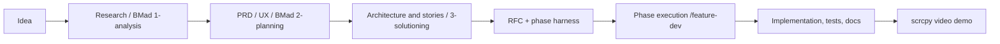

# From idea to implementation (and video demo)

This document describes the sequence used in this repository: from an initial idea through research and specification (including BMad and `_bmad-output`), RFC construction, phase execution with the agent harness, to closing with an Android screen demo recorded via [scrcpy](https://github.com/Genymobile/scrcpy).

> **Where things live:** BMad planning artifacts → [`_bmad-output/`](../_bmad-output/) · per-initiative spec → [`rfcs/`](../rfcs/) · execution state → [`tasks/rfc-xxxx/`](../tasks/) · shared rules → [`AGENTS.md`](../AGENTS.md) and [`CLAUDE.md`](../CLAUDE.md).

---

## End-to-end flow (high level)

In practice, **1-analysis** and **2-planning** can be more or less formal; the important part is to leave a trail in `_bmad_output` (and in `docs/` when useful) before freezing the RFC.

---

## 1. Idea and research

**Goal:** turn intuition into shareable context (for you and for agents).

- **Exploration:** *brainstorm*, *product brief*, or *PRFAQ* (BMad Method — `1-analysis` phase), depending on how formed the idea is.
- **Domain and technical research:** *Domain Research* and *Technical Research* produce notes and documents; in this project, output is partly under [`_bmad-output/planning-artifacts`](../_bmad-output/planning-artifacts) and [`docs/`](../docs/) (see `_bmad/bmm/config.yaml` — `planning_artifacts` and `project_knowledge`).
- **Typical output:** a minimal set of files in `_bmad-output` (and/or `docs/`) that answer: *problem*, *actors*, *constraints*, *risks*, *what success looks like*.

*BMad phase names and order:* see [`_bmad/_config/bmad-help.csv`](../_bmad/_config/bmad-help.csv) (`phase` column — e.g. `1-analysis`, `2-planning`, `3-solutioning`, `4-implementation`).

---

## 2. Product and UX planning (before the technical RFC)

**Goal:** align *what* before *how* in code.

- **PRD** and, if the UI is central, **UX design** (BMad `2-planning`).
- **PRD validation** when you want a quality gate before architecture.
- Artifacts stay in `planning_artifacts` / `docs` per BMM config.

When that is mature enough, you describe the **technical initiative** in the RFC (next section) — the repo RFC is the engineering and phasing “contract,” not a replacement for the PRD.

---

## 3. Solution, stories, and readiness (optional; useful for larger work)

**Goal:** separate “technical decisions” and “scope cuts” before locking the final RFC.

- **Architecture** (`bmad-create-architecture`), **epics and stories** (`bmad-create-epics-and-stories`), **readiness** (`bmad-check-implementation-readiness`) — BMad `3-solutioning` phase.
- If you use TEA, test design and CI can land here; the passkeys POC already folded much of that into RFC-0001 phases.

---

## 4. RFC and task harness construction

**Goal:** a single spec (the RFC) plus phase files any agent can track.

1. **Draft the RFC** from [`rfcs/_template-rfc.md`](../rfcs/_template-rfc.md): problem, options with trade-offs, decision, phase plan.
2. **Scaffold the harness** for the RFC number, generating `tasks/rfc-xxxx/` and updating `AGENTS.md` and `tasks/README.md`:
   - Command in [`AGENTS.md`](../AGENTS.md) (section 0):  
     `/feature-dev create harness for RFC-XXXX`
3. Each phase becomes a `fase-....md` with subtasks, completion criterion, parallelism map, and orchestrator instructions — pattern in [`tasks/_template-fase.md`](../tasks/_template-fase.md).

The RFC completes the path from “business / research document” → “versioned engineering plan” → “measured, phase-by-phase execution.”

---

## 5. Execution: phases and agents

**Goal:** implement with durable state, not only chat context.

- Per-phase command (see table in `AGENTS.md`):  
  `/feature-dev execute RFC-XXXX phase <identifier>`
- Each orchestrator reads the matching `fase-....md`, updates status `[ ]` / `[~]` / `[x]` / `[!]`, and only proceeds when the **completion criterion** (verified with a real command) is met.
- **Parallelism:** subtasks with no dependency run in parallel; the rest is sequential within the phase; **phases** are sequential within the same RFC.

BMad **implementation** artifacts, when used, point to [`_bmad-output/implementation-artifacts`](../_bmad-output/implementation-artifacts) (`implementation_artifacts` in BMM). This repo’s harness remains the source of truth for *what is done* per RFC.

---

## 6. Closing: documentation and feedback

- Common last phase: consolidate `CLAUDE.md`, READMEs, move the RFC to `rfcs/completed/`, and record **Feedback Forward** in `tasks/feedback-forward.md` when applicable (see [`AGENTS.md`](../AGENTS.md) §8).

---

## 7. Video demo with scrcpy

**Goal:** capture visual proof of the flow (e.g. Android app + local server), aligned with “Home Proof” or whatever the RFC defined.

[scrcpy](https://github.com/Genymobile/scrcpy) mirrors and controls an Android device or emulator over USB (or TCP/IP), with good performance for **screen recording** with OBS, QuickTime (window capture), or similar.

**Typical dev setup overview:**

1. Emulator or device with the app installed (in this project: `npx expo run:android` / dev client).
2. `adb` working; for the emulator to reach the local backend, this project’s flow includes `adb reverse tcp:3000 tcp:3000` (see [`CLAUDE.md`](../CLAUDE.md)).
3. Start scrcpy, targeting a serial if needed:  
   `scrcpy`  
   or `scrcpy -s <serial>` when multiple devices are present.
4. Record the scrcpy window or use `--record=file.mp4` per the [project README (recording section)](https://github.com/Genymobile/scrcpy#recording) (options change by release — check the README for your installed version).

That makes the “last mile” of the workflow explicit: **code + tests + a reproducible video demo.**

---

## Summary: suggested order

| Step | What | Where |
|------|------|--------|
| 1 | Idea + research (domain/technical) | `_bmad-output/`, `docs/` |
| 2 | PRD/UX (if applicable) | `planning_artifacts` / `docs` |
| 3 | Architecture + stories + readiness (if applicable) | planning artifacts |
| 4 | RFC + `tasks/rfc-xxxx/` + AGENTS/README | `rfcs/`, `tasks/` |
| 5 | `/feature-dev execute …` phase by phase | `tasks/…/fase-*.md` |
| 6 | Docs + completed + feedback | `CLAUDE.md`, `rfcs/completed/`, `tasks/feedback-forward.md` |
| 7 | Demo recording | scrcpy + recorder |

To choose **which BMad skill to run next**, use [`bmad-help`](../.claude/skills/bmad-help/SKILL.md) and the [`bmad-help.csv`](../_bmad/_config/bmad-help.csv) catalog.
