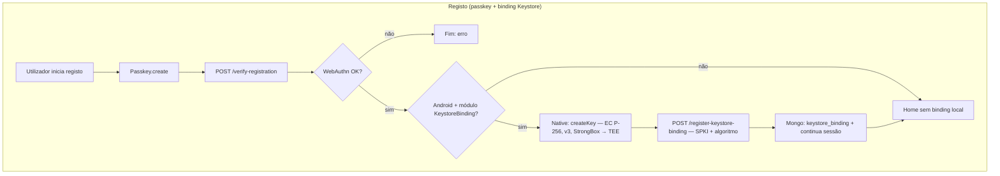
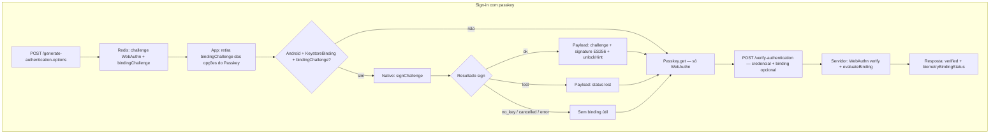
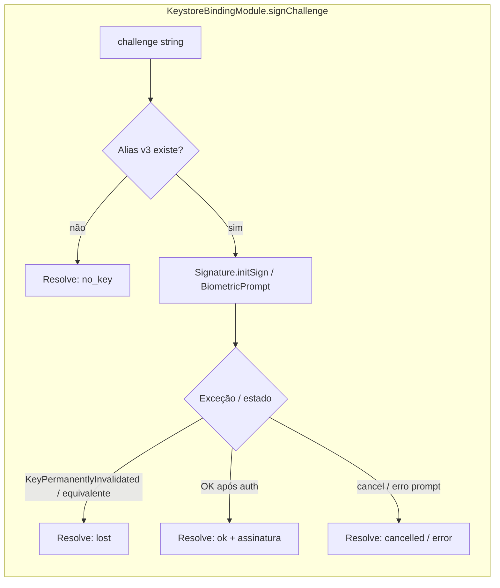
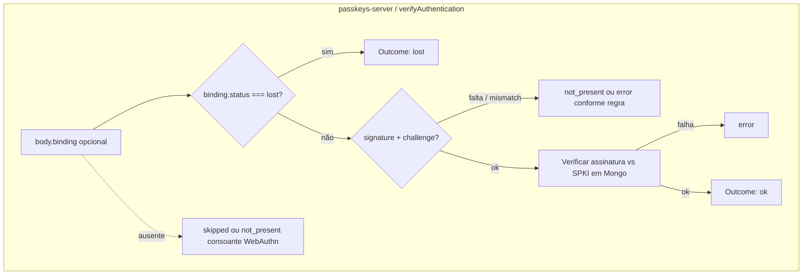
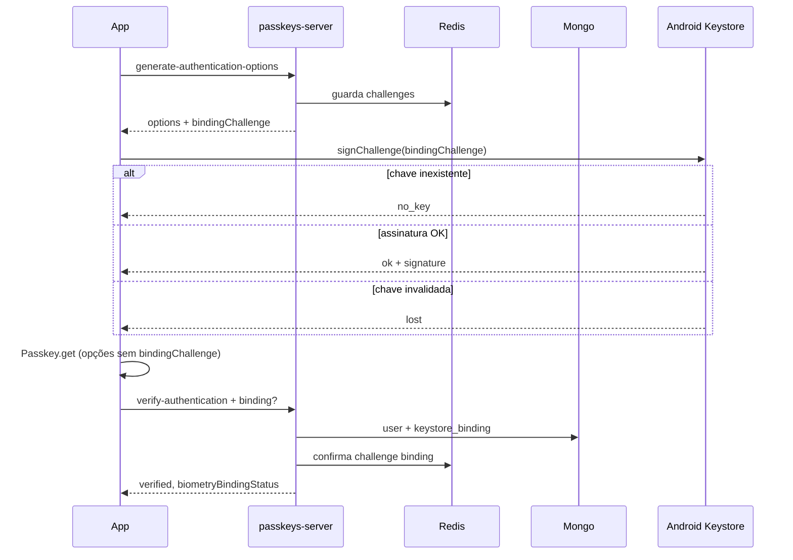

# passkeys-app

**Expo dev build** client for the passkeys (WebAuthn) PoC. Do **not** use **Expo Go** — the native flow requires `expo-dev-client`.

## Repository documentation

Full setup (Docker, HTTPS with mkcert, `adb reverse`, server env vars, Android fingerprint): [`../CLAUDE.md`](../CLAUDE.md).

## Icon and splash (RFC-0003)

Branded PNGs live in [`assets/images/`](./assets/images/) (`icon`, `adaptive-icon`, `splash-icon`, `favicon`, and Android-specific `splash-android`). `app.json` uses Light Clean background `#F8FAFC` for the app shell, `expo-splash-screen`, and the Android adaptive icon. If you change those assets or splash config and the repo contains a generated [`android/`](./android/) tree, run `npx expo prebuild --platform android` (or a full `npx expo run:android` that runs prebuild) so native `colors.xml`, splash drawables, and mipmaps stay in sync. Spec: [`../rfcs/completed/RFC-0003-visual-identity.md`](../rfcs/completed/RFC-0003-visual-identity.md).

## Commands

| Command | Purpose |
|---------|---------|
| `npx expo run:android` | Build and install on emulator/device |
| `npm start` | Metro / dev server (after native build) |
| `npm test` | Jest (`services/api.ts` and related tests) |
| `npm run lint` | ESLint (script in `package.json` calls the binary in `node_modules`) |

## UX flow demo (RFC-0002)

1. Infra: `docker-compose up -d`, server in `passkeys-server` (`npm run dev`), `adb reverse tcp:3000 tcp:3000`.
2. Open the app, enter a username.
3. **Create passkey** or **Sign in with passkey** and complete the system prompt.
4. The `/home` route shows a short verification proof (`verified`, `passkey` method, etc.). **Logout** returns to the entry screen (`/`).

Main routes: `app/index.tsx` (entry), `app/home.tsx` (authenticated). HTTP only in `services/api.ts`.

## Fluxos — Keystore binding (Android, PoC)

Chave assimétrica no **Android Keystore** (P-256), autenticação forte por biometria, SPKI no servidor, challenge assinado no login. Código: `android/.../keystore/KeystoreBindingModule.kt`, `services/keystoreBinding.ts`, `app/index.tsx`. Servidor: `passkeys-server` (rotas de binding, `evaluateBinding`).

### Registo: passkey + primeira binding

### Login: opções, assinatura de binding e passkey

### Android — saídas de `signChallenge`

### Servidor — `evaluateBinding` e `biometryBindingStatus`

### Sequência (login com binding)

---

## Expo (reference)

This app was created with [`create-expo-app`](https://www.npmjs.com/package/create-expo-app). Docs: [Expo](https://docs.expo.dev/), [Expo Router](https://docs.expo.dev/router/introduction/), [development builds](https://docs.expo.dev/develop/development-builds/introduction/).
