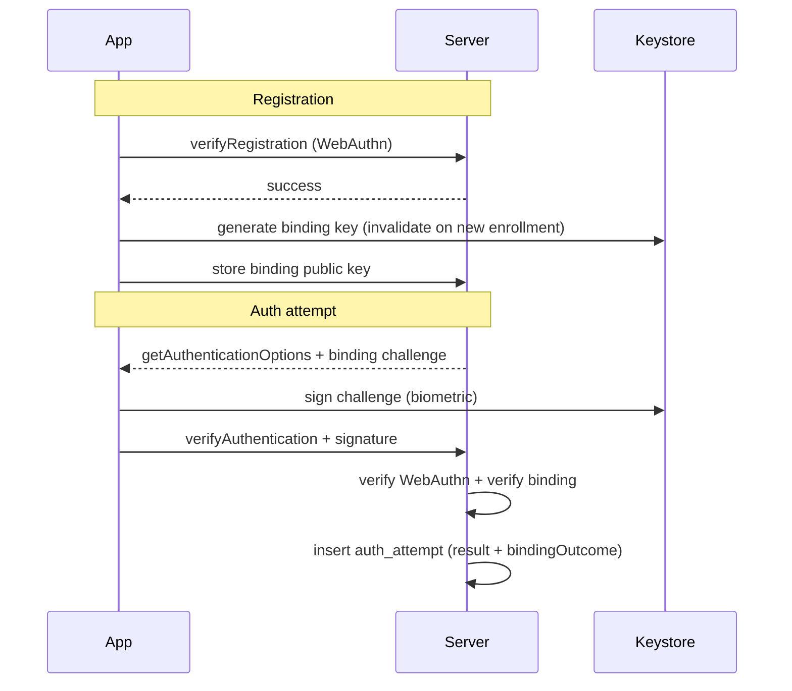

# RFC-0004: Android Keystore binding + per-authentication audit (biometry change signal) — PoC

## Overview

This RFC proposes a **scope-limited experiment** in the passkeys-solution repository to validate
two hypotheses in an **Android-only** client:

1. **Audit trail**: every authentication attempt (success or failure) is **persisted** in the
   backend data store with enough context to reconstruct who, when, and what happened at the
   WebAuthn layer.
2. **Biometry / enrollment change signal (app-controlled)**: alongside passkey use, the client
   maintains an **application-managed** key in the Android Keystore with
   `setInvalidatedByBiometricEnrollment(true)` and reports a **derived, server-verifiable** signal
   on each attempt. A **missing or failed** binding (e.g. key invalidated after new biometric
   enrollment) is stored explicitly so the backend can **flag** “binding lost / possible enrollment
   change” **without** OTP, Liveness, or iOS/web in this PoC.

The PoC **does not** add recovery UX beyond logging and response flags: **no** OTP, **no** Liveness,
**no** production-grade risk engine.

## Background & context

### Current state

- `passkeys-server` already exposes WebAuthn registration and authentication; credentials live in
  MongoDB, challenges in Redis.
- `passkeys-app` (Expo / React Native) runs the passkey flow; **separate** native code (or a small
  native module) is required to create/use an app-owned Keystore key; this is **out of band** from
  the FIDO2 credential object itself.
- The Relying Party does **not** receive “biometry changed” from WebAuthn; the approach here relies
  on a **second** key pair owned by the app, as described in product discussions: bind at
  registration, re-sign or re-attest on each authentication, compare on the server with stored
  material.

### Glossary

| Term | Definition |
|------|------------|
| Passkey (FIDO2) | Platform credential used by WebAuthn; distinct from the app binding key. |
| Binding key | App-generated asymmetric key in Android Keystore, invalidated when new biometrics are enrolled (policy per API level / OEM). |
| Biometry change signal (PoC) | Server-stored result of binding verification: e.g. `binding_ok` \| `binding_lost` \| `binding_not_present` \| `binding_error` — not a raw Keystore “metric”. |
| Auth attempt record | One row per authentication **attempt** (not only success), with timestamps and outcome. |

## Problem statement

We need **evidence in the database** to test whether an **app-managed Keystore binding** can
reliably **correlate** with “likely biometric enrollment change” in a **controlled PoC**, while
**logging every auth attempt** for analysis.

**If we do not address this:** we only have WebAuthn success/failure with no per-attempt story and
no structured signal for the Keystore hypothesis.

## Hypothesis (testable)

**H1.** Persisting a **binding public key** (or attestation handle) at registration and **verifying
a client proof** (signature over a server challenge) on each authentication allows the server to
**detect** `binding_lost` when the Keystore key is no longer usable after biometric enrollment
changes on the device.

**H2.** A **per-attempt audit log** (including failures and binding outcome) is sufficient for
offline review of the PoC without OTP/Liveness.

## Goals & non-goals

### Goals

- [ ] New persistence for **authentication attempts** (minimum: `userId` / anonymous key,
  `timestamp`, `outcome` success|fail, `error_code` if any, `credentialId` if any, `binding_outcome`
  enum, optional `client_metadata` (app version, etc.)).
- [ ] New persistence for **registration-time binding** (e.g. `userId` + `binding_public_key` or
  thumbprint of attestation + `created_at`); idempotent or replace-per-credential as decided in
  design.
- [ ] **Android app**: create binding key after successful passkey registration (or in the same
  user journey); on each **authentication** call, perform binding **proof** and send it in the
  API payload the server can verify.
- [ ] **Server**: verify proof, set `binding_outcome`, **never** block passkey success solely on
  binding in PoC mode **unless** a feature flag says otherwise (default: log + flag, still allow auth
  for experiment visibility — see Open Questions).
- [ ] **Manual test script** / checklist: register → auth → add fingerprint in Settings → auth
  again; expect `binding_lost` on the attempt where the key is invalidated.

### Non-goals

- iOS, web, or non-Android clients.
- OTP, SMS, e-mail Liveness, or **step-up** flows that are user-facing in production quality.
- Replacing or weakening WebAuthn verification.

## Evaluation criteria

| Criterion | Weight | Description |
|----------|--------|-------------|
| Audit completeness | High | Every attempt stored with outcome and binding outcome. |
| Hypothesis clarity | High | Distinguish WebAuthn failure from binding `binding_lost` in stored records. |
| PoC safety | High | No silent security regression; binding is additive, flag-driven. |
| Implementation cost | Medium | Smallest change that proves H1–H2 on emulator. |

## Options analysis

### Option A: Server-only — log WebAuthn attempts

**Description:** Extend authentication routes to write **attempt** records; no app Keystore
changes.

**Pros:** Fast; unblocks audit-only analysis.

**Cons:** Does **not** test the biometry / enrollment change hypothesis (H1).

**Effort:** Low. **Risk:** None for Keystore. **Conclusion:** Optional **Phase 0** if needed before
app work.

### Option B: App Keystore binding + server verification (recommended for H1)

**Description:** As in Goals: binding key at registration, challenge-response on each auth, server
compares to stored public key, persist `binding_outcome`.

**Pros:** Directly tests the discussed model; data for research.

**Cons:** Native module or config complexity; behavior varies by API level; legitimate “add
fingerprint” looks like `binding_lost` from the server’s perspective.

**Effort:** Medium. **Risk:** Medium (UX/flags); mitigated by PoC default “log only” for blocking.

## Recommendation

Adopt **Option B** for the PoC, optionally preceded by **Option A** if audit storage should land
first without native changes.

**Default PoC policy:** on `binding_lost`, **record** and **return** a field such as
`biometryBinding: "lost"` in the API response, but **do not** deny the WebAuthn authentication
unless `AUTH_DENY_ON_BINDING_LOST=true` in server config (for stricter dry-runs). This keeps the
experiment **observable** even when the user cannot complete a second factor.

## Technical design

### Data model (MongoDB — illustrative)

- **`auth_attempts`** (new collection)  
  - `_id`, `userId` (or stable subject id), `createdAt`  
  - `result`: `webauthn_success` \| `webauthn_failure`  
  - `errorCode?`, `credentialId?`  
  - `bindingOutcome`: `ok` \| `lost` \| `not_present` \| `error` \| `skipped`  
  - `bindingErrorDetail?` (string, no secrets)  
  - `appVersion?`, `androidSdk?` (optional)

- **`keystore_binding`** (or fields on `users` / `credentials` — to be decided)  
  - `userId` + `credentialId` (or one binding per user for PoC)  
  - `publicKeyJwk` or **SPKI base64** of the binding public key at registration time  
  - `createdAt`, `revokedAt?`

**Indexes:** `userId` + `createdAt` for auth attempts; unique constraint as appropriate for binding
per user/credential in PoC.

### API (illustrative — exact paths in implementation)

- **POST** (extend) verify-authentication (or **POST** `.../auth/verify` body):  
  - Existing WebAuthn payload **plus** optional `binding`:  
    - `{ "challenge": "<server-issued>", "algorithm": "...", "signature": "<b64>" }`  
  - Server: verify WebAuthn; **if** `binding` present, verify Ed25519/EC P-256 (match generated key
    type) over `challenge`; set `bindingOutcome`.

- **GET** (optional): issue **short-lived** `bindingChallenge` before the client calls passkey
  auth, or embed challenge in authentication options (simplest: return challenge in
  `getAuthenticationOptions` extension field for PoC).

- Response JSON may include:  
  `authAttemptId`, `biometryBindingStatus` (or reuse `bindingOutcome` in response for app
  display/debug).

**Security note:** the binding proof must use a **server-issued, one-time, short-TTL** challenge
stored in Redis (similar to WebAuthn challenge) to prevent replay. Reuse the existing pattern where
reasonable.

### Android client (conceptual)

1. **After** successful passkey **registration** (same session): create Keystore key with  
   `setUserAuthenticationRequired(true)` + `setInvalidatedByBiometricEnrollment(true)`; export
   public key to server (new small API or part of “complete registration” call).
2. On **authentication**: obtain server challenge; **unlock the key** with the same user
   authentication the Keystore enforces (often **biometric or device PIN** / pattern, depending on
   policy and device — see **PoC limitations** and **Open questions** on how to log or name this
   in the PoC); sign; send with verify call.
3. If `KeyPermanentlyInvalidatedException` or equivalent: send `binding: { "status": "lost" }` or
   omit signature and let server set `binding_lost` with explicit reason code.

**Expo / RN:** implement via **native module** or **expo prebuild** + Kotlin; exact file layout
documented in the implementation phase.

### Sequence (happy path + biometry change)

## Implementation plan

**Harness (agent execution):** use `/feature-dev execute RFC-0004 phase <1|2|3>`; task files in `tasks/rfc-0004/`.

| Phase | Task file |
|-------|-----------|
| 1 | `tasks/rfc-0004/fase-1-server-audit-binding.md` |
| 2 | `tasks/rfc-0004/fase-2-android-keystore.md` |
| 3 | `tasks/rfc-0004/fase-3-documentacao.md` |

### Phase 1 — Server: audit + binding storage

| Step | Area | Description |
|------|------|-------------|
| 1.1 | `infra/database` | New functions for `auth_attempts` and `keystore_binding` (or fields). |
| 1.2 | `infra/api` + `setup` | Config flag `AUTH_DENY_ON_BINDING_LOST` (default `false` for PoC). |
| 1.3 | `authentication/` | After verify, write attempt; if binding present, verify and set outcome. |
| 1.4 | Tests | Jest: binding signature verification, attempt row shape, feature flag. |

**Completion criterion:** `npm test` in `passkeys-server` passes; manual `curl` can insert/read
sample attempt (or integration test).

### Phase 2 — Android: Keystore + payload

| Step | Area | Description |
|------|------|-------------|
| 2.1 | Native / module | Create binding key; export public key; sign server challenge. |
| 2.2 | `services/api.ts` | Send binding payload on verify; handle errors from Keystore. |
| 2.3 | `app/index.tsx` (or single entry) | Wire post-registration and pre-auth flow per project rules. |

**Completion criterion:** On emulator, register → auth shows `binding_ok` in server DB; add
fingerprint → next auth shows `binding_lost` in DB.

### Phase 3 — PoC documentation & closure

- Short “how to test” in `CLAUDE.md` or a **PoC note** (per documentation phase of this RFC, not in
  this draft file’s scope to execute now).
- Move RFC to `rfcs/completed/` when the PoC is evaluated.

**Completion criterion:** Another developer can run the manual checklist in Phase 2.

### Rollback

- Disable binding verification via config; stop writing new collections if needed; app sends no
  `binding` field — server marks `binding_skipped`. No data migration required for WebAuthn core.

### Pre-existing data and migration (PoC policy)

**No backfill** of `auth_attempts` for authentication events that occurred **before** this PoC is
deployed; the audit trail starts when the new code first writes rows. **No migration script** is
required for existing MongoDB user or WebAuthn credential documents: they remain valid unchanged.

**`auth_attempts` and `keystore_binding` start empty** (or only grow from new traffic). Accounts
that existed **without** a registered binding public key are **not** retrofitted automatically;
successful WebAuthn authentications from those accounts use `bindingOutcome` **`not_present`** or
**`skipped`** (per implementation) until the client completes the **post-registration binding**
flow (Phase 2) or equivalent. The PoC default remains **non-blocking** for passkey success when
binding is absent, unless product policy changes later.

**Stale or duplicate `keystore_binding` rows** after passkey restore or device change are covered by
**Open Question 10** (reconciliation / `revokedAt`); if out of scope for the PoC, behavior is
**documented in phase Notes**, not silently assumed.

## Success metrics (PoC)

- N ≥ 1 full **manual** run of: register → auth (`binding_ok`) → Settings add fingerprint → auth
  (`binding_lost` in `auth_attempts` at least once on the failure path, or on success path with
  explicit flag, depending on implementation that matches Keystore behavior on that API level).
- All authentication attempts in the test run **queryable** in MongoDB with timestamps.

## PoC limitations

These bounds apply to **interpreting results** and **stakeholder communication**; they do not
invalidate the experiment if stated explicitly in the RFC and the Decision Record.

- **`binding_lost` ≠ “attacker proved”.** The same outcome follows **legitimate** enrollment changes
  (e.g. user adds a second fingerprint). The server infers *possible* enrollment or key
  invalidation, not *malice*.
- **Not “pure biometry”.** The binding key is unlocked with the device’s **user authentication**
  policy (commonly **biometric or device PIN** / pattern). The PoC does **not** assert that the
  user used a sensor rather than a PIN unless the app enforces a stricter `KeyProperties` / prompt
  policy and documents it.
- **OEM / API variance.** `setInvalidatedByBiometricEnrollment` and StrongBox/TEE behavior may
  **differ** by API level and manufacturer. A **null** or unexpected result on one image is a
  **documented negative or inconclusive** run for H1, not a silent pass.
- **Emulator vs physical device.** Evidence gathered on the **emulator** may not generalize to
  production hardware; external-validity limitations belong in the Decision Record.
- **Volume and noise in `auth_attempts`.** Failed WebAuthn attempts, scans, and tests can **inflate**
  rows. High row count does not imply a security event without context (see rate limiting in Open
  questions).
- **Two server-issued challenges.** A flawed client or server that **mixes** or **replays** WebAuthn
  and binding challenges undermines the value of the binding proof; implementation discipline is
  part of the hypothesis test.

**Brainstorming capture:** session notes in
`_bmad-output/brainstorming/brainstorming-session-2026-04-25-1200.md` (Question Storming, Reverse
Brainstorming, Six Thinking Hats).

## Open questions

1. **Block WebAuthn on `binding_lost`?** PoC default: **no** (log only + response flag). Confirm for
   regulatory or demo needs.
2. **One binding per user vs per credential?** Per-credential is cleaner if a user has multiple
   passkeys; PoC may start with **one** binding per `userId`.
3. **Min SDK** for Keystore flags: confirm `minSdkVersion` in `passkeys-app` and test matrix
   (emulator API levels).
4. **Key algorithm:** P-256 vs Ed25519 — align with `KeyGenParameterSpec` and server crypto library.
5. **PIN vs biometrics for unlocking the binding key:** how does the app **classify** and what does
   the server **store** (e.g. `binding_outcome` / metadata) when the user **authenticates with PIN**
   instead of a biometric sensor? Is a separate “unlock method” field (PoC-only) required?
6. **Fallback policy (product + research):** should the binding flow **allow only** strong
   biometrics and **disallow** PIN / credential fallback? What are **accessibility** and
   **usability** trade-offs for a real product vs this PoC?
7. **Retention and PII for `auth_attempts`:** even on a **local** research MongoDB, define **purpose**,
   **retention period** or export policy, and **minimization** of fields (LGPD / internal policy as
   applicable).
8. **Ground truth for “enrollment changed”:** aside from `binding_lost` **inference**, is any
   **independent** label (e.g. scripted test step, user-reported event) required for a credible lab
   notebook?
9. **Abuse and noise:** should inserts into `auth_attempts` be **rate-limited** or **deduplicated**
   per IP / per user to avoid drawing false patterns from traffic noise?
10. **Passkey / GPM restore vs app binding:** if the user restores passkeys to a new device but the
    app **re-registers** a new binding public key, how are **stale** `keystore_binding` rows
    **reconciled** or marked `revoked`?
11. **Schema stability:** add **`schemaVersion`** (or equivalent) on attempt/binding documents so
    exports from different implementation iterations stay **comparable**.

## Decision record

**Decision:** Accepted — H1 and H2 confirmed.

### Outcome

**H1 confirmed** on physical device (Samsung SM-A165M, API 36, 2026-04-26):

- Happy path: `binding=ok suspicious=false` — BiometricPrompt authenticates, key signs challenge,
  server verifies SPKI signature, `auth_attempts` row written.
- Suspicious path: after adding a second fingerprint in Settings, next sign-in returns
  `binding=lost suspicious=true`, server denies access (`verified=false`), app shows blocked
  message instead of navigating to home.

**H2 confirmed:** every attempt (success and failure) is queryable in MongoDB `auth_attempts`
with `bindingOutcome`, `userId`, `createdAt`, `result`, and `suspiciousActivity` flag.

### Open questions resolved

| # | Question | Resolution |
|---|----------|-----------|
| Q1 | Block WebAuthn on `binding_lost`? | **Yes** — `AUTH_DENY_ON_BINDING_LOST=true` in PoC; server returns `verified=false` + `suspiciousActivity=true`; app blocks navigation. |
| Q2 | One binding per user vs per credential? | **One per userId** (`keystore_binding` unique index on `userId`); sufficient for PoC. |
| Q3 | Min SDK for Keystore flags | **API 24+** (`setInvalidatedByBiometricEnrollment` requires N+); tested on API 36. |
| Q4 | Key algorithm | **P-256** (ECDSA/SHA-256); SPKI export; server uses `createVerify('SHA256')` + `dsaEncoding: 'der'`. |
| Q5 | PIN vs biometrics for unlock | `bindingUnlockHint: "biometric"` stored in `auth_attempts`; BiometricPrompt configured with `BIOMETRIC_STRONG` only (no device credential in PoC). |
| Q11 | Schema stability | `schemaVersion: 1` on both `auth_attempts` and `keystore_binding` documents. |

### Open questions resolved (Phase 4 hardening, 2026-04-26)

| # | Question | Resolution |
|---|----------|-----------|
| Q9 | Abuse / noise rate limiting | **Resolved** — per-userId rate limit in Redis, 3 attempts per 5-min window (`AUTH_RATE_LIMIT_MAX`). Exceeded → 429 + `auth_attempts` row with `errorCode: "rate_limited"`. |
| Q10 | Passkey restore / stale `keystore_binding` | **Resolved** — `registerKeystoreBinding` now calls `revokeKeystoreBinding` (sets `revokedAt` on all active rows) then `insertKeystoreBinding`. Active binding = row without `revokedAt`. History is retained. |
| Q5/Q6 | PIN vs biometrics for unlock / fallback policy | **Resolved (PoC)** — server detects `bindingUnlockHint: "device_credential"` and, when `AUTH_DENY_ON_BINDING_PIN_UNLOCK=true`, returns `verified=false, blockReason="pin_unlock", suspiciousActivity=false`. App shows distinct message. |

### Open questions deferred

| # | Question | Status |
|---|----------|--------|
| Q6 | Fallback policy / accessibility (production) | Deferred — PoC enforces biometric-only; product policy to be decided for production. |
| Q7 | Retention and PII | Deferred — local MongoDB only; no automated TTL; document on first production deploy. |
| Q8 | Ground truth for enrollment change | Partially addressed — manual checklist in `poc-checklist-executed.md`. |

### Bugs fixed during execution (not in original RFC scope)

Three Android-layer bugs were found and fixed during phase 2 validation on a physical device:

1. **Keystore2 auth at finish time** — `initSign` succeeds but `sign()` throws `KEY_USER_NOT_AUTHENTICATED` on API 31+; fixed by always routing through `BiometricPrompt` after `initSign` instead of attempting `update`/`sign` directly.
2. **Missing negative button text** — `BiometricPrompt.PromptInfo` on API 30+ requires `setNegativeButtonText` when using `BIOMETRIC_STRONG` without device credential; added `"Cancel"`.
3. **UI thread violation** — `BiometricPrompt` must be created and `authenticate()` called from the main thread; React Native `@ReactMethod` runs on a background thread; fixed with `act.runOnUiThread { }`.

### Harness

| Phase | Task file |
|-------|-----------|
| 1 | `tasks/rfc-0004/fase-1-server-audit-binding.md` |
| 2 | `tasks/rfc-0004/fase-2-android-keystore.md` |
| 3 | `tasks/rfc-0004/fase-3-documentacao.md` |
| 4 | `tasks/rfc-0004/fase-4-hardening.md` |

Brainstorming notes: `_bmad-output/brainstorming/brainstorming-session-2026-04-25-1200.md`
